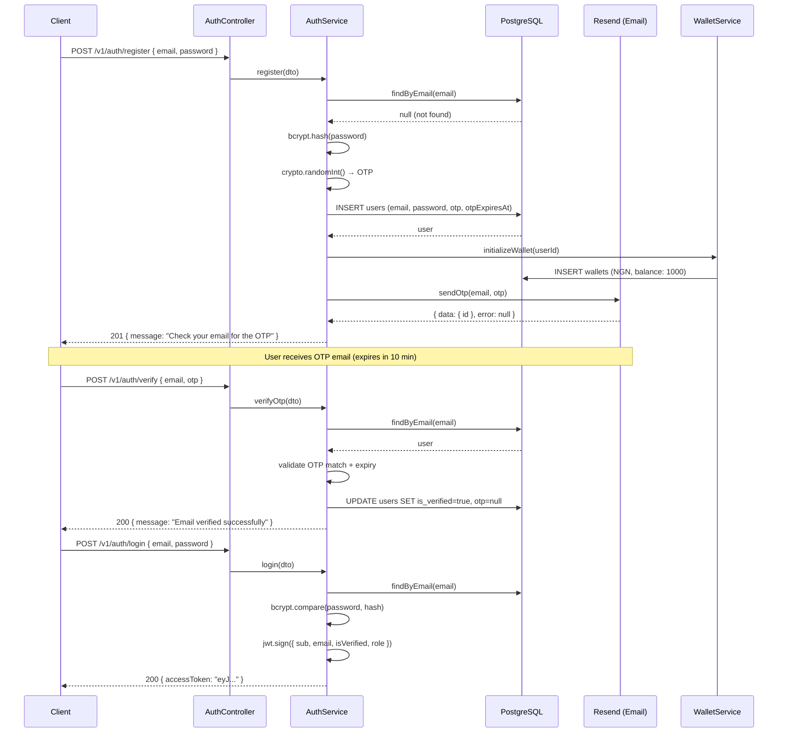
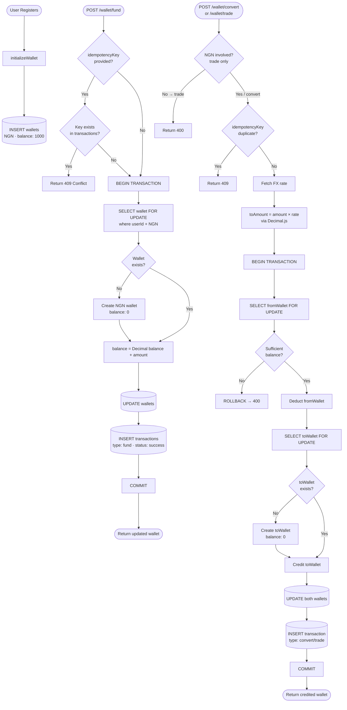
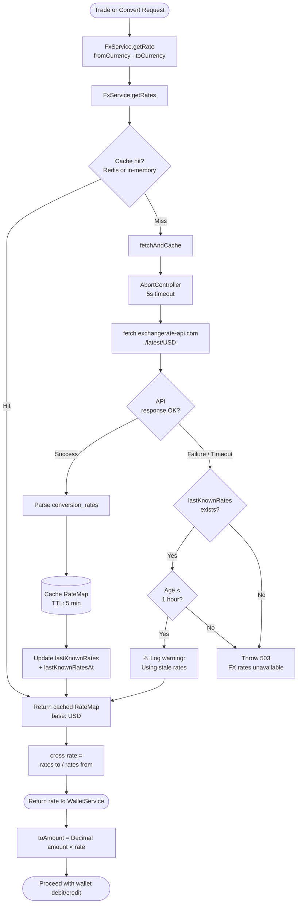

# FX Trading API

NestJS backend for multi-currency FX trading. Users register, fund NGN wallets, and convert or trade between NGN, USD, EUR, GBP, CAD, and JPY using real-time exchange rates.

---

## Tech Stack

| Layer | Technology |
|---|---|
| Framework | NestJS |
| ORM / Database | TypeORM + PostgreSQL 15+ |
| Cache | Redis (optional — falls back to in-memory) |
| FX Rates | exchangerate-api.com |
| Email | Resend |
| Auth | JWT + OTP email verification |
| Logging | nestjs-pino (structured JSON) |

---

## Prerequisites

- Node.js 20+
- PostgreSQL 15+ (or Docker)
- Redis (optional)
- [Resend](https://resend.com) account (free tier)
- [exchangerate-api.com](https://www.exchangerate-api.com) account (free tier)

---

## Setup

### 1. Clone and install

```bash
git clone <repo-url>
cd fx-trading
npm install
```

### 2. Configure environment

```bash
cp .env.example .env
```

Fill in `.env` — see [Environment Variables](#environment-variables) below.

### 3. Create the database

```bash
# Docker
docker run --name fx-postgres \
  -e POSTGRES_PASSWORD=postgres \
  -e POSTGRES_DB=fx_trading \
  -p 5432:5432 -d postgres:15

# Native PostgreSQL
psql -U postgres -c "CREATE DATABASE fx_trading;"
```

### 4. Run

```bash
npm run start:dev    # development (watch mode)
npm run start:prod   # production
npm run build        # compile only
```

- App: `http://localhost:3000`
- Swagger UI: `http://localhost:3000/api/docs`

---

## Database

### Migrations

In development, `synchronize: true` keeps the schema in sync automatically. For production, use migrations.

```bash
# Generate a migration after changing an entity
npm run migration:generate -- src/migrations/MigrationName

# Apply pending migrations
npm run migration:run

# Roll back the last migration
npm run migration:revert

# List applied and pending migrations
npm run migration:show
```

Migration files are generated into `src/migrations/` and should be committed to version control.

### Visualization

TypeORM doesn't ship with a built-in database browser. Connect any standard PostgreSQL client to `localhost:5432`:

| Tool | Notes |
|---|---|
| **pgAdmin 4** | Ships with PostgreSQL — already available if you installed Postgres locally |
| **TablePlus** | Clean native app for macOS/Windows, free tier is sufficient |
| **DBeaver** | Cross-platform, fully free |
| **VS Code** | Install the "Database Client" extension and connect directly from the editor |

> **Note:** If a built-in visual browser is a hard requirement, [Prisma ORM](https://www.prisma.io) is worth considering as an alternative to TypeORM — it ships with Prisma Studio (`npx prisma studio`), a zero-config table browser at `localhost:5555`. This project uses TypeORM for its maturity and flexibility with complex query builders.

---

## Environment Variables

| Variable | Required | Default | Description |
|---|---|---|---|
| `PORT` | No | `3000` | HTTP port |
| `NODE_ENV` | No | `development` | `development` or `production` |
| `DB_HOST` | Yes | `localhost` | PostgreSQL host |
| `DB_PORT` | No | `5432` | PostgreSQL port |
| `DB_USER` | Yes | — | PostgreSQL username |
| `DB_PASS` | Yes | — | PostgreSQL password |
| `DB_NAME` | Yes | `fx_trading` | Database name |
| `JWT_SECRET` | Yes | — | Secret for signing JWT tokens |
| `JWT_EXPIRES_IN` | No | `7d` | Token lifetime |
| `RESEND_API_KEY` | Yes | — | Resend API key (`re_...`) |
| `MAIL_FROM` | Yes | — | Verified sender address — use `onboarding@resend.dev` for testing |
| `FX_API_KEY` | Yes | — | exchangerate-api.com API key |
| `FX_BASE_URL` | No | `https://v6.exchangerate-api.com/v6` | FX API base URL |
| `FX_CACHE_TTL_SECONDS` | No | `300` | How long to cache FX rates (seconds) |
| `REDIS_HOST` | No | `localhost` | Redis host — app functions without Redis |
| `REDIS_PORT` | No | `6379` | Redis port |
| `INITIAL_NGN_BALANCE` | No | `1000` | NGN credited to new accounts on signup |

---

## Flow Diagrams

### 1. Auth & Onboarding



---

### 2. Wallet Management



---

### 3. Currency Exchange (FX Rate Handling)



---

## API Endpoints

All routes are prefixed with `/v1`. Protected routes require `Authorization: Bearer <token>`.

### Auth

| Method | Endpoint | Auth | Description |
|---|---|---|---|
| POST | `/v1/auth/register` | — | Register and send OTP to email |
| POST | `/v1/auth/verify` | — | Verify OTP, activate account |
| POST | `/v1/auth/login` | — | Login, returns JWT |
| POST | `/v1/auth/resend-otp` | — | Request a new OTP if previous expired (rate-limited) |

### Wallet

| Method | Endpoint | Auth | Description |
|---|---|---|---|
| GET | `/v1/wallet` | JWT + verified | All currency balances |
| POST | `/v1/wallet/fund` | JWT + verified | Add NGN to wallet |
| POST | `/v1/wallet/convert` | JWT + verified | Convert between any two currencies |
| POST | `/v1/wallet/trade` | JWT + verified | Trade NGN ↔ foreign currency |

### FX

| Method | Endpoint | Auth | Description |
|---|---|---|---|
| GET | `/v1/fx/rates` | JWT | Current exchange rates (USD base) |

### Transactions

| Method | Endpoint | Auth | Description |
|---|---|---|---|
| GET | `/v1/transactions?page=1&limit=20` | JWT + verified | Paginated transaction history |

### Admin

Admin endpoints require a user with `role: admin`. See [Roles](#roles) below.

| Method | Endpoint | Auth | Description |
|---|---|---|---|
| GET | `/v1/admin/analytics` | JWT + admin | Platform overview — user counts, volumes, top users |
| GET | `/v1/admin/users?page=1&limit=20` | JWT + admin | All users paginated |
| GET | `/v1/admin/transactions?page=1&limit=20&type=trade` | JWT + admin | All transactions, filterable by type |

Full request/response schemas are in Swagger at `/api/docs`.

---

## Roles

The system has two roles: `user` (default) and `admin`. The role is embedded in the JWT at login — no extra DB call on each request.

**Every new account is assigned `user` on signup.** There is no API endpoint for role promotion by design — granting admin access requires a direct database change by someone who already has DB access:

```sql
UPDATE users SET role = 'admin' WHERE email = 'admin@example.com';
```

This is intentional. Exposing a role-promotion endpoint would be a security risk. Admin access is an ops-level action, not a product-level one.

Admin routes return `403 Forbidden` for any token without the `admin` role.

---

## Architecture Decisions

### Multi-currency wallets

Each currency balance is a separate row in the `wallets` table keyed on `(user_id, currency)`. Adding a new currency requires no schema changes — only appending to the `SUPPORTED_CURRENCIES` constant.

### Double-spend prevention

All balance operations run inside a PostgreSQL transaction with `SELECT ... FOR UPDATE` (pessimistic write lock). Concurrent requests on the same wallet queue rather than race.

### FX rate caching

Rates are fetched from exchangerate-api.com and cached in Redis (or in-memory if Redis is unavailable) for 5 minutes. If the external API is down, the last cached rates serve as a fallback for up to 1 hour before the service returns an error.

### `convert` vs `trade`

Both deduct one currency and credit another at real-time rates. `trade` enforces NGN on one side of the pair. `convert` is unrestricted. Both are recorded separately in transaction history.

### Idempotency

All mutating wallet endpoints accept an optional `idempotencyKey`. Submitting the same key twice returns the original result without re-executing the operation.

### Auth & verification gate

After registration, users receive a 6-digit OTP by email (generated with `crypto.randomInt` — not `Math.random`). Only verified accounts access wallet and trading endpoints. `isVerified` and `role` are embedded in the JWT payload to avoid DB lookups on every request.

### RBAC

Role-based access uses a `RolesGuard` that reads the `role` claim from the JWT. The `@Roles()` decorator is applied at the controller or handler level. Currently two roles exist: `user` and `admin`.

---

## Key Assumptions

- **Wallet funding is simulated.** No payment gateway is integrated. In production, this would integrate with a provider like Paystack: initiate a charge, confirm via webhook, and credit only on a confirmed payment event with idempotency on the payment reference.
- **Supported currencies are fixed** at NGN, USD, EUR, GBP, CAD, JPY. Adding a new one requires only appending to `SUPPORTED_CURRENCIES` in `fx.service.ts`.
- **FX cross-rates use USD as the base.** NGN/EUR is computed as `rates['EUR'] / rates['NGN']`.
- **OTPs expire in 10 minutes** and are single-use. Calling resend-otp invalidates any previous OTP.
- **New users start with 1,000 NGN** (configurable via `INITIAL_NGN_BALANCE`).
- **Schema auto-sync** (`synchronize: true`) is on in development only. Run migrations in production.

---

## Scaling Considerations

- Redis is abstracted behind a `CacheService`. Ensuring Redis availability in production removes the in-memory fallback and enables consistent cache sharing across instances.
- The wallet locking strategy handles high per-user concurrency. Cross-user contention is negligible — each user's wallets are independent rows.
- The FX service is stateless and cache-driven. A shared Redis instance across app instances ensures all nodes use the same rates.
- For large scale: partition `wallets` and `transactions` by `user_id`, add read replicas for history and analytics queries, and move FX rate fetching to a dedicated background worker.
